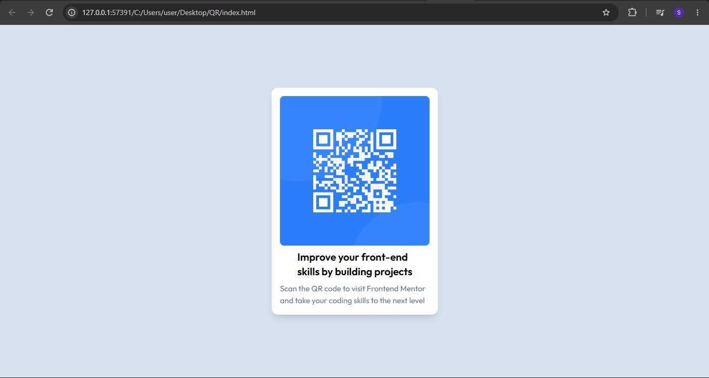

# Frontend Mentor - QR code component solution

This is a solution to the [QR code component challenge on Frontend Mentor](https://www.frontendmentor.io/challenges/qr-code-component-iux_sIO_H). Frontend Mentor challenges help you improve your coding skills by building realistic projects. 

## Table of contents

  - [Screenshot](#screenshot)
  - [Links](#links)
  - [Built with](#built-with)
  - [What I learned](#what-i-learned)
  - [Author](#author)

### Screenshot

### Links

- Solution URL: [here](https://github.com/spaceeboy/QR-code-component)
- Live Site URL: [here](https://spaceeboy.github.io/QR-code-component/)

### Built with

- Semantic HTML5 markup
- Tailwind CSS
- Flexbox
- Mobile-responsive

### What I learned

Before starting with JSX, it's better when you start with the core, know how to write markup, make static content with markup you barely need mb of Javascript just to render a static content. 

## Author

- Frontend Mentor - [@spaceeboy](https://www.frontendmentor.io/profile/spaceeboy)
